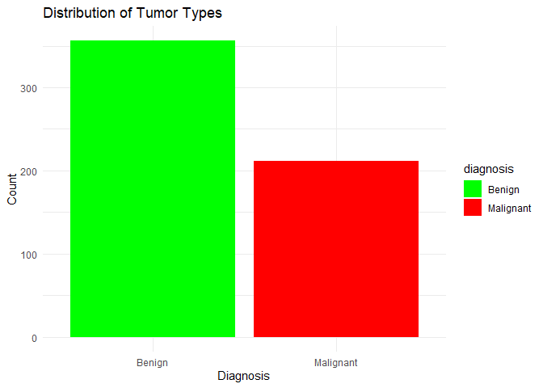
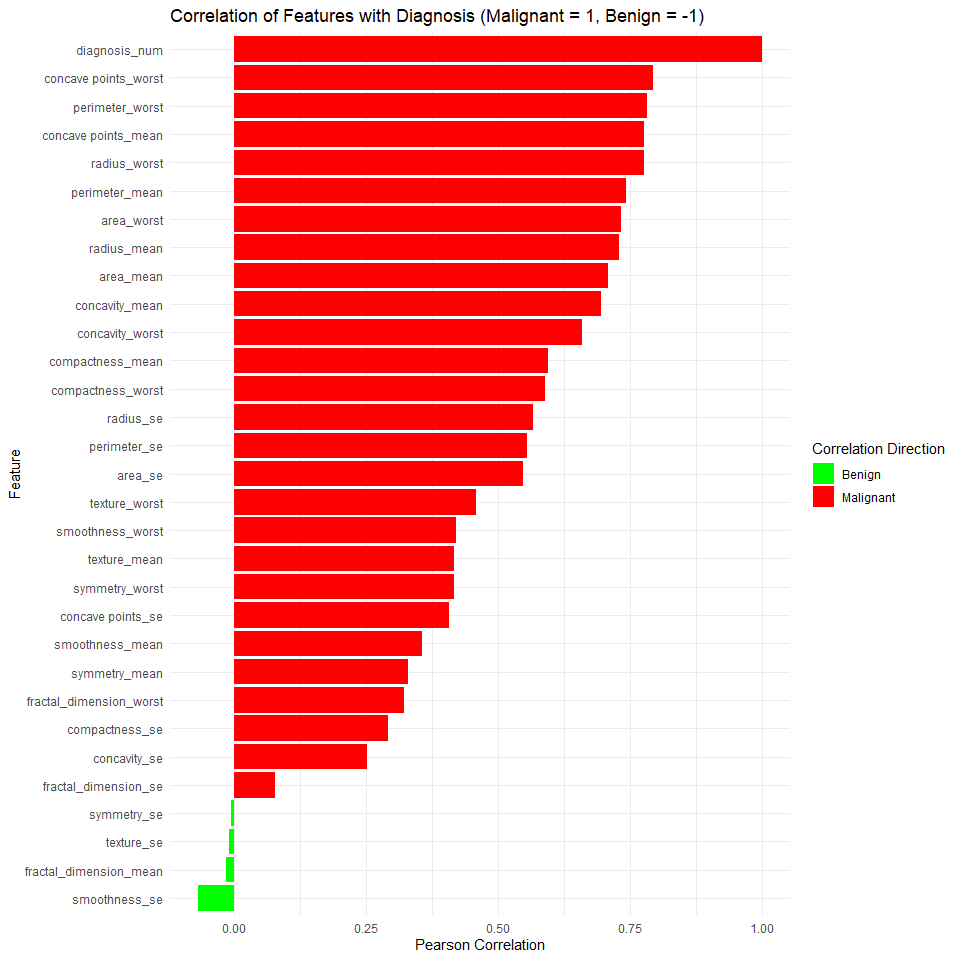
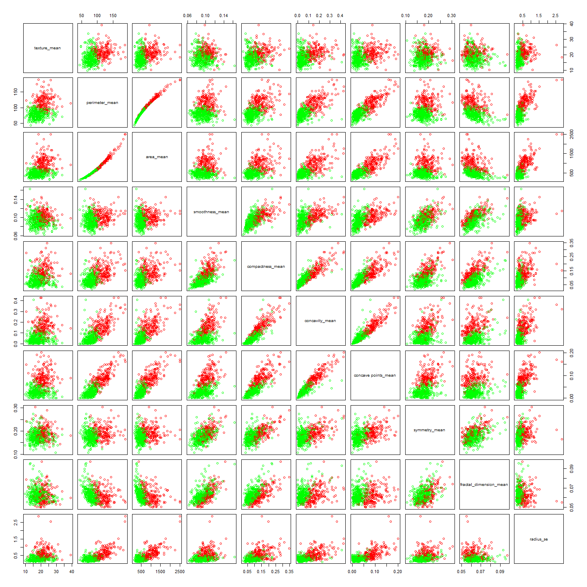
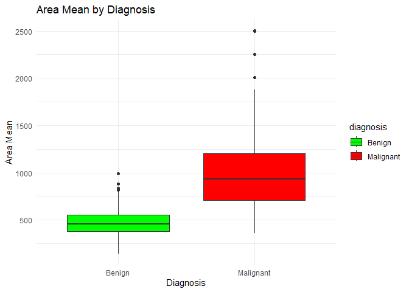
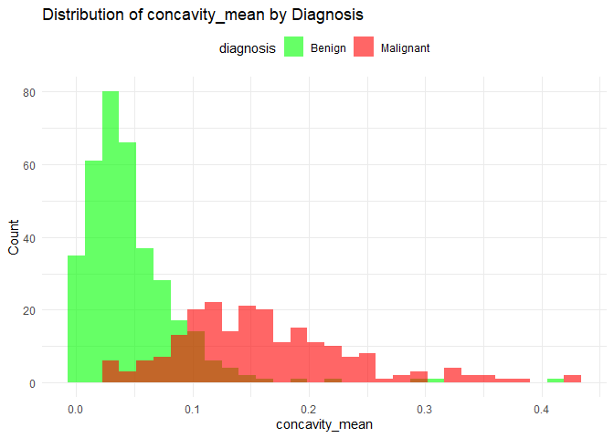

DS2020 Final Project Report
================
Hong Hao Khoo and Harsh Mishrikotkar
2025-04-28

# Benign or Malignant Tumor

## Introduction/Background

A tumor is a lump or mass of tissue that forms when cells grow and
divide too much or don’t die when they should. The word tumor is often
used interchangeably with cancer. Cancer is a group of diseases
characterized by the uncontrolled growth and spread of abnormal cells in
the body. Scientifically, tumors can be categorized into benign or
malignant. Benign tumors do not invade nearby tissues or spread to other
parts of the body, whereas malignant tumors do. Malignant tumors are
what we call cancer. If it is malignant, then it is a cancer otherwise
it is not.

After a patient is diagnosed with a tumor, a crucial next step is
determining whether it is benign or malignant. This is often done
through a biopsy, which can be invasive, painful, and stressful. The
goal of this project is to explore whether measurable tumor
characteristics can help increase the chances of identifying the tumor
type through imaging techniques and improve the accuracy of that
identification. By analyzing features such as size, shape, and texture,
we aim to support the development of more accessible, non-invasive
diagnostic tools that can complement or even reduce the reliance on
biopsies.

## Project Goals and Questions

When diagnosed with tumor but not knowing if it’s benign or malignant is
a confusing and frightening moment - you’re stuck waiting, hoping for
good news but scared of the worst. In this project, we aim to analyze a
data set containing records of patients diagnosed with tumors. Each
patient is assigned a unique ID and labeled with the tumor type—either
benign or malignant. The data set also includes various visual
characteristics of the tumors, each represented by a corresponding
numerical value.

Through the analysis of this data set, we hope to find out:

1.  Is there a correlation between the characteristics and the type of
    tumor?

2.  Which characteristic is the most highly correlated and which is
    lowest to the type of tumor?

3.  Can we predict whether a tumor is benign or malignant base on its
    characteristics?

4.  Is it possible to speed up the process of identifying whether a
    tumor is benign or malignant?

5.  Can we increase chances of identifying tumor type from imaging
    techniques?

6.  Can we increase accuracy of identifying tumor type from imaging
    techniques?

## Data set

The link to the data set is
<https://www.kaggle.com/datasets/erdemtaha/cancer-data>. The website
contains a downloadable csv file, which is the tumor dataset. This
dataset have 569 observations and 32 variables. The data set contain
records of patients diagnosed with tumor. Each patient is given an
unique ID along with the type of tumor, benign or malignant. It also
contains the visual characteristics of the tumor and a value for each of
these characteristics.

``` r
# Import dataset
data <- read_csv("Cancer_Data.csv")
```

    ## New names:
    ## • `` -> `...33`

    ## Warning: One or more parsing issues, call `problems()` on your data frame for details,
    ## e.g.:
    ##   dat <- vroom(...)
    ##   problems(dat)

    ## Rows: 568 Columns: 33
    ## ── Column specification ────────────────────────────────────────────────────────
    ## Delimiter: ","
    ## chr  (1): diagnosis
    ## dbl (31): id, radius_mean, texture_mean, perimeter_mean, area_mean, smoothne...
    ## lgl  (1): ...33
    ## 
    ## ℹ Use `spec()` to retrieve the full column specification for this data.
    ## ℹ Specify the column types or set `show_col_types = FALSE` to quiet this message.

``` r
data <- data[1:(length(data)-1)]

# View dataset
head(data, 10)
```

    ## # A tibble: 10 × 32
    ##          id diagnosis radius_mean texture_mean perimeter_mean area_mean
    ##       <dbl> <chr>           <dbl>        <dbl>          <dbl>     <dbl>
    ##  1   842302 M                18.0         10.4          123.      1001 
    ##  2   842517 M                20.6         17.8          133.      1326 
    ##  3 84300903 M                19.7         21.2          130       1203 
    ##  4 84348301 M                11.4         20.4           77.6      386.
    ##  5 84358402 M                20.3         14.3          135.      1297 
    ##  6   843786 M                12.4         15.7           82.6      477.
    ##  7   844359 M                18.2         20.0          120.      1040 
    ##  8 84458202 M                13.7         20.8           90.2      578.
    ##  9   844981 M                13           21.8           87.5      520.
    ## 10 84501001 M                12.5         24.0           84.0      476.
    ## # ℹ 26 more variables: smoothness_mean <dbl>, compactness_mean <dbl>,
    ## #   concavity_mean <dbl>, `concave points_mean` <dbl>, symmetry_mean <dbl>,
    ## #   fractal_dimension_mean <dbl>, radius_se <dbl>, texture_se <dbl>,
    ## #   perimeter_se <dbl>, area_se <dbl>, smoothness_se <dbl>,
    ## #   compactness_se <dbl>, concavity_se <dbl>, `concave points_se` <dbl>,
    ## #   symmetry_se <dbl>, fractal_dimension_se <dbl>, radius_worst <dbl>,
    ## #   texture_worst <dbl>, perimeter_worst <dbl>, area_worst <dbl>, …

## Cleaning & Observation

``` r
summary(data)
```

    ##        id             diagnosis          radius_mean      texture_mean  
    ##  Min.   :     8670   Length:568         Min.   : 6.981   Min.   : 9.71  
    ##  1st Qu.:   869222   Class :character   1st Qu.:11.707   1st Qu.:16.17  
    ##  Median :   906157   Mode  :character   Median :13.375   Median :18.84  
    ##  Mean   : 30425140                      Mean   :14.139   Mean   :19.28  
    ##  3rd Qu.:  8825022                      3rd Qu.:15.797   3rd Qu.:21.79  
    ##  Max.   :911320502                      Max.   :28.110   Max.   :39.28  
    ##  perimeter_mean     area_mean      smoothness_mean   compactness_mean 
    ##  Min.   : 43.79   Min.   : 143.5   Min.   :0.06251   Min.   :0.01938  
    ##  1st Qu.: 75.20   1st Qu.: 420.3   1st Qu.:0.08640   1st Qu.:0.06517  
    ##  Median : 86.29   Median : 551.4   Median :0.09589   Median :0.09312  
    ##  Mean   : 92.05   Mean   : 655.7   Mean   :0.09644   Mean   :0.10445  
    ##  3rd Qu.:104.15   3rd Qu.: 784.1   3rd Qu.:0.10533   3rd Qu.:0.13043  
    ##  Max.   :188.50   Max.   :2501.0   Max.   :0.16340   Max.   :0.34540  
    ##  concavity_mean    concave points_mean symmetry_mean    fractal_dimension_mean
    ##  Min.   :0.00000   Min.   :0.00000     Min.   :0.1060   Min.   :0.04996       
    ##  1st Qu.:0.02958   1st Qu.:0.02035     1st Qu.:0.1620   1st Qu.:0.05770       
    ##  Median :0.06155   Median :0.03360     Median :0.1792   Median :0.06155       
    ##  Mean   :0.08896   Mean   :0.04901     Mean   :0.1812   Mean   :0.06280       
    ##  3rd Qu.:0.13100   3rd Qu.:0.07401     3rd Qu.:0.1957   3rd Qu.:0.06613       
    ##  Max.   :0.42680   Max.   :0.20120     Max.   :0.3040   Max.   :0.09744       
    ##    radius_se        texture_se      perimeter_se       area_se       
    ##  Min.   :0.1115   Min.   :0.3602   Min.   : 0.757   Min.   :  6.802  
    ##  1st Qu.:0.2324   1st Qu.:0.8331   1st Qu.: 1.605   1st Qu.: 17.850  
    ##  Median :0.3240   Median :1.1080   Median : 2.285   Median : 24.565  
    ##  Mean   :0.4052   Mean   :1.2165   Mean   : 2.867   Mean   : 40.374  
    ##  3rd Qu.:0.4798   3rd Qu.:1.4743   3rd Qu.: 3.360   3rd Qu.: 45.237  
    ##  Max.   :2.8730   Max.   :4.8850   Max.   :21.980   Max.   :542.200  
    ##  smoothness_se      compactness_se      concavity_se     concave points_se 
    ##  Min.   :0.001713   Min.   :0.002252   Min.   :0.00000   Min.   :0.000000  
    ##  1st Qu.:0.005166   1st Qu.:0.013133   1st Qu.:0.01510   1st Qu.:0.007663  
    ##  Median :0.006374   Median :0.020460   Median :0.02592   Median :0.010950  
    ##  Mean   :0.007041   Mean   :0.025515   Mean   :0.03195   Mean   :0.011817  
    ##  3rd Qu.:0.008151   3rd Qu.:0.032455   3rd Qu.:0.04212   3rd Qu.:0.014730  
    ##  Max.   :0.031130   Max.   :0.135400   Max.   :0.39600   Max.   :0.052790  
    ##   symmetry_se       fractal_dimension_se  radius_worst   texture_worst  
    ##  Min.   :0.007882   Min.   :0.0008948    Min.   : 7.93   Min.   :12.02  
    ##  1st Qu.:0.015128   1st Qu.:0.0022445    1st Qu.:13.03   1st Qu.:21.07  
    ##  Median :0.018725   Median :0.0031955    Median :14.97   Median :25.41  
    ##  Mean   :0.020531   Mean   :0.0037967    Mean   :16.28   Mean   :25.67  
    ##  3rd Qu.:0.023398   3rd Qu.:0.0045585    3rd Qu.:18.80   3rd Qu.:29.68  
    ##  Max.   :0.078950   Max.   :0.0298400    Max.   :36.04   Max.   :49.54  
    ##  perimeter_worst    area_worst     smoothness_worst  compactness_worst
    ##  Min.   : 50.41   Min.   : 185.2   Min.   :0.07117   Min.   :0.02729  
    ##  1st Qu.: 84.15   1st Qu.: 515.7   1st Qu.:0.11660   1st Qu.:0.14758  
    ##  Median : 97.67   Median : 686.5   Median :0.13135   Median :0.21300  
    ##  Mean   :107.35   Mean   : 881.7   Mean   :0.13244   Mean   :0.25460  
    ##  3rd Qu.:125.53   3rd Qu.:1085.0   3rd Qu.:0.14602   3rd Qu.:0.33930  
    ##  Max.   :251.20   Max.   :4254.0   Max.   :0.22260   Max.   :1.05800  
    ##  concavity_worst  concave points_worst symmetry_worst   fractal_dimension_worst
    ##  Min.   :0.0000   Min.   :0.00000      Min.   :0.1565   Min.   :0.05504        
    ##  1st Qu.:0.1159   1st Qu.:0.06497      1st Qu.:0.2504   1st Qu.:0.07147        
    ##  Median :0.2275   Median :0.10002      Median :0.2821   Median :0.08005        
    ##  Mean   :0.2727   Mean   :0.11481      Mean   :0.2901   Mean   :0.08397        
    ##  3rd Qu.:0.3835   3rd Qu.:0.16168      3rd Qu.:0.3180   3rd Qu.:0.09208        
    ##  Max.   :1.2520   Max.   :0.29100      Max.   :0.6638   Max.   :0.20750

``` r
str(data)
```

    ## tibble [568 × 32] (S3: tbl_df/tbl/data.frame)
    ##  $ id                     : num [1:568] 842302 842517 84300903 84348301 84358402 ...
    ##  $ diagnosis              : chr [1:568] "M" "M" "M" "M" ...
    ##  $ radius_mean            : num [1:568] 18 20.6 19.7 11.4 20.3 ...
    ##  $ texture_mean           : num [1:568] 10.4 17.8 21.2 20.4 14.3 ...
    ##  $ perimeter_mean         : num [1:568] 122.8 132.9 130 77.6 135.1 ...
    ##  $ area_mean              : num [1:568] 1001 1326 1203 386 1297 ...
    ##  $ smoothness_mean        : num [1:568] 0.1184 0.0847 0.1096 0.1425 0.1003 ...
    ##  $ compactness_mean       : num [1:568] 0.2776 0.0786 0.1599 0.2839 0.1328 ...
    ##  $ concavity_mean         : num [1:568] 0.3001 0.0869 0.1974 0.2414 0.198 ...
    ##  $ concave points_mean    : num [1:568] 0.1471 0.0702 0.1279 0.1052 0.1043 ...
    ##  $ symmetry_mean          : num [1:568] 0.242 0.181 0.207 0.26 0.181 ...
    ##  $ fractal_dimension_mean : num [1:568] 0.0787 0.0567 0.06 0.0974 0.0588 ...
    ##  $ radius_se              : num [1:568] 1.095 0.543 0.746 0.496 0.757 ...
    ##  $ texture_se             : num [1:568] 0.905 0.734 0.787 1.156 0.781 ...
    ##  $ perimeter_se           : num [1:568] 8.59 3.4 4.58 3.44 5.44 ...
    ##  $ area_se                : num [1:568] 153.4 74.1 94 27.2 94.4 ...
    ##  $ smoothness_se          : num [1:568] 0.0064 0.00522 0.00615 0.00911 0.01149 ...
    ##  $ compactness_se         : num [1:568] 0.049 0.0131 0.0401 0.0746 0.0246 ...
    ##  $ concavity_se           : num [1:568] 0.0537 0.0186 0.0383 0.0566 0.0569 ...
    ##  $ concave points_se      : num [1:568] 0.0159 0.0134 0.0206 0.0187 0.0188 ...
    ##  $ symmetry_se            : num [1:568] 0.03 0.0139 0.0225 0.0596 0.0176 ...
    ##  $ fractal_dimension_se   : num [1:568] 0.00619 0.00353 0.00457 0.00921 0.00511 ...
    ##  $ radius_worst           : num [1:568] 25.4 25 23.6 14.9 22.5 ...
    ##  $ texture_worst          : num [1:568] 17.3 23.4 25.5 26.5 16.7 ...
    ##  $ perimeter_worst        : num [1:568] 184.6 158.8 152.5 98.9 152.2 ...
    ##  $ area_worst             : num [1:568] 2019 1956 1709 568 1575 ...
    ##  $ smoothness_worst       : num [1:568] 0.162 0.124 0.144 0.21 0.137 ...
    ##  $ compactness_worst      : num [1:568] 0.666 0.187 0.424 0.866 0.205 ...
    ##  $ concavity_worst        : num [1:568] 0.712 0.242 0.45 0.687 0.4 ...
    ##  $ concave points_worst   : num [1:568] 0.265 0.186 0.243 0.258 0.163 ...
    ##  $ symmetry_worst         : num [1:568] 0.46 0.275 0.361 0.664 0.236 ...
    ##  $ fractal_dimension_worst: num [1:568] 0.1189 0.089 0.0876 0.173 0.0768 ...

``` r
# Convert diagnosis to factor
dataClean <- data %>%
  mutate(diagnosis = factor(diagnosis, levels = c("B", "M"), labels = c("Benign", "Malignant")))

# Drop ID column
dataClean <- dataClean %>% select(-id)

# Check for any missing values in the rest of the data set
colSums(is.na(dataClean))
```

    ##               diagnosis             radius_mean            texture_mean 
    ##                       0                       0                       0 
    ##          perimeter_mean               area_mean         smoothness_mean 
    ##                       0                       0                       0 
    ##        compactness_mean          concavity_mean     concave points_mean 
    ##                       0                       0                       0 
    ##           symmetry_mean  fractal_dimension_mean               radius_se 
    ##                       0                       0                       0 
    ##              texture_se            perimeter_se                 area_se 
    ##                       0                       0                       0 
    ##           smoothness_se          compactness_se            concavity_se 
    ##                       0                       0                       0 
    ##       concave points_se             symmetry_se    fractal_dimension_se 
    ##                       0                       0                       0 
    ##            radius_worst           texture_worst         perimeter_worst 
    ##                       0                       0                       0 
    ##              area_worst        smoothness_worst       compactness_worst 
    ##                       0                       0                       0 
    ##         concavity_worst    concave points_worst          symmetry_worst 
    ##                       0                       0                       0 
    ## fractal_dimension_worst 
    ##                       0

For cleaning of the data, we assigned the cleaned version of our data
set to a new data set called dataClean. For dataClean, we converted
variable diagnosis to type factor with levels “B” and “M” and labels
“Benign” and “Malignant”. Secondly, the id column was dropped as it is
not relevant. After that, we check if the data set have any missing
values and there was none.

## Variables

- diagnosis : Benign or Malignant cancer
- radius_mean : Radius mean value
- texture_mean : Texture mean value
- perimeter_mean : Perimeter mean value
- area_mean : Area mean value
- smoothness_mean : Smoothness mean value
- compactness_mean : Compactness mean value
- concavity_mean : Concavity mean value
- concave points_mean : Concave points mean value
- symmetry_mean : Symmetry mean value
- fractal_dimension_mean : Fractal dimension mean value
- radius_se : Radius standard error value
- texture_se : Texture standard error value
- perimeter_se : Perimeter standard error value
- area_se : Area standarad error value
- smoothness_se : Smoothness standard error value
- compactness_se : Compactness standard error value
- concavity_se : Concavity standard error value
- concave points_se : Concave points standard error value
- symmetry_se : Symmetry standard error value
- fractal_dimension_se : Fractal dimension standard error value
- radius_worst : Radius worst value
- texture_worst : Texture worst value
- perimeter_worst : Perimeter worst value
- area_worst : Area worst value
- smoothness_worst : Smoothness worst value
- compactness_worst : Compactness worst value
- concavity_worst : Concavity worst value
- concave points_worst : Concave points worst value
- symmetry_worst : Symmetry worst value
- fractal_dimension_worst : Fractal dimension worst value

## Statistics Summary

``` r
# Basic statistics summary for each column
stats_summary <- data.frame(
  Column = character(),
  Min = numeric(),
  Q1 = numeric(),
  Median = numeric(),
  Mean = numeric(),
  Q3 = numeric(),
  Max = numeric(),
  SD = numeric(),
  stringsAsFactors = FALSE
)

for (col_name in names(dataClean)[sapply(dataClean, is.numeric)]) {
  col_data <- dataClean[[col_name]]
  stats_summary <- rbind(stats_summary, data.frame(
    Column = col_name,
    Min = min(col_data, na.rm = TRUE),
    Q1 = quantile(col_data, 0.25, na.rm = TRUE),
    Median = median(col_data, na.rm = TRUE),
    Mean = mean(col_data, na.rm = TRUE),
    Q3 = quantile(col_data, 0.75, na.rm = TRUE),
    Max = max(col_data, na.rm = TRUE),
    SD = sd(col_data, na.rm = TRUE)
  ))
}

# Display summary statistics 
print(stats_summary)
```

    ##                        Column       Min          Q1      Median         Mean
    ## 25%               radius_mean 6.981e+00 1.17075e+01  13.3750000 1.413850e+01
    ## 25%1             texture_mean 9.710e+00 1.61700e+01  18.8350000 1.928040e+01
    ## 25%2           perimeter_mean 4.379e+01 7.52000e+01  86.2900000 9.204658e+01
    ## 25%3                area_mean 1.435e+02 4.20300e+02 551.4000000 6.557234e+02
    ## 25%4          smoothness_mean 6.251e-02 8.64000e-02   0.0958950 9.643727e-02
    ## 25%5         compactness_mean 1.938e-02 6.51750e-02   0.0931250 1.044479e-01
    ## 25%6           concavity_mean 0.000e+00 2.95750e-02   0.0615450 8.895565e-02
    ## 25%7      concave points_mean 0.000e+00 2.03475e-02   0.0336000 4.900527e-02
    ## 25%8            symmetry_mean 1.060e-01 1.61975e-01   0.1792500 1.812014e-01
    ## 25%9   fractal_dimension_mean 4.996e-02 5.76975e-02   0.0615450 6.280458e-02
    ## 25%10               radius_se 1.115e-01 2.32375e-01   0.3239500 4.052063e-01
    ## 25%11              texture_se 3.602e-01 8.33150e-01   1.1080000 1.216482e+00
    ## 25%12            perimeter_se 7.570e-01 1.60500e+00   2.2855000 2.866619e+00
    ## 25%13                 area_se 6.802e+00 1.78500e+01  24.5650000 4.037438e+01
    ## 25%14           smoothness_se 1.713e-03 5.16625e-03   0.0063745 7.040718e-03
    ## 25%15          compactness_se 2.252e-03 1.31325e-02   0.0204600 2.551479e-02
    ## 25%16            concavity_se 0.000e+00 1.50975e-02   0.0259200 3.194987e-02
    ## 25%17       concave points_se 0.000e+00 7.66275e-03   0.0109500 1.181690e-02
    ## 25%18             symmetry_se 7.882e-03 1.51275e-02   0.0187250 2.053135e-02
    ## 25%19    fractal_dimension_se 8.948e-04 2.24450e-03   0.0031955 3.796685e-03
    ## 25%20            radius_worst 7.930e+00 1.30250e+01  14.9700000 1.628118e+01
    ## 25%21           texture_worst 1.202e+01 2.10750e+01  25.4050000 2.566896e+01
    ## 25%22         perimeter_worst 5.041e+01 8.41475e+01  97.6650000 1.073459e+02
    ## 25%23              area_worst 1.852e+02 5.15675e+02 686.5500000 8.816606e+02
    ## 25%24        smoothness_worst 7.117e-02 1.16600e-01   0.1313500 1.324433e-01
    ## 25%25       compactness_worst 2.729e-02 1.47575e-01   0.2130000 2.545992e-01
    ## 25%26         concavity_worst 0.000e+00 1.15925e-01   0.2274500 2.726677e-01
    ## 25%27    concave points_worst 0.000e+00 6.49675e-02   0.1000150 1.148080e-01
    ## 25%28          symmetry_worst 1.565e-01 2.50350e-01   0.2820500 2.900808e-01
    ## 25%29 fractal_dimension_worst 5.504e-02 7.14675e-02   0.0800500 8.396968e-02
    ##                Q3       Max           SD
    ## 25%   1.57975e+01 2.811e+01 3.516986e+00
    ## 25%1  2.17850e+01 3.928e+01 4.299166e+00
    ## 25%2  1.04150e+02 1.885e+02 2.424982e+01
    ## 25%3  7.84150e+02 2.501e+03 3.516606e+02
    ## 25%4  1.05325e-01 1.634e-01 1.395600e-02
    ## 25%5  1.30425e-01 3.454e-01 5.279766e-02
    ## 25%6  1.31000e-01 4.268e-01 7.970273e-02
    ## 25%7  7.40100e-02 2.012e-01 3.878258e-02
    ## 25%8  1.95700e-01 3.040e-01 2.742220e-02
    ## 25%9  6.61275e-02 9.744e-02 7.064628e-03
    ## 25%10 4.79800e-01 2.873e+00 2.775560e-01
    ## 25%11 1.47425e+00 4.885e+00 5.520633e-01
    ## 25%12 3.36000e+00 2.198e+01 2.023593e+00
    ## 25%13 4.52375e+01 5.422e+02 4.552239e+01
    ## 25%14 8.15100e-03 3.113e-02 3.005158e-03
    ## 25%15 3.24550e-02 1.354e-01 1.790259e-02
    ## 25%16 4.21175e-02 3.960e-01 3.018291e-02
    ## 25%17 1.47300e-02 5.279e-02 6.155788e-03
    ## 25%18 2.33975e-02 7.895e-02 8.269529e-03
    ## 25%19 4.55850e-03 2.984e-02 2.648062e-03
    ## 25%20 1.87950e+01 3.604e+01 4.829018e+00
    ## 25%21 2.96750e+01 4.954e+01 6.148512e+00
    ## 25%22 1.25525e+02 2.512e+02 3.357133e+01
    ## 25%23 1.08500e+03 4.254e+03 5.692780e+02
    ## 25%24 1.46025e-01 2.226e-01 2.278293e-02
    ## 25%25 3.39300e-01 1.058e+00 1.572729e-01
    ## 25%26 3.83500e-01 1.252e+00 2.084945e-01
    ## 25%27 1.61675e-01 2.910e-01 6.561368e-02
    ## 25%28 3.18025e-01 6.638e-01 6.192187e-02
    ## 25%29 9.20825e-02 2.075e-01 1.806821e-02

These are the statistics summary for every numeric variable of the data
set.

## Results

### Visual 1 (Tumor Type Distribution Bar Plot)

``` r
# Bar plot with custom colors
ggplot(dataClean, aes(x = diagnosis, fill = diagnosis)) +
  geom_bar() +
  scale_fill_manual(values = c("Benign" = "green", "Malignant" = "red")) +
  labs(title = "Distribution of Tumor Types", x = "Diagnosis", y = "Count") +
  theme_minimal()
```

<!-- -->

To understand the class distribution in our data set, we created a bar
plot comparing the number of benign and malignant tumors. This
visualization revealed that benign tumors are more common in the data
set than malignant ones.

This class imbalance is important to note, as it may affect the
performance of classification models. Models trained on imbalanced data
might become biased toward predicting the majority class (benign), so
additional techniques like resampling or adjusting evaluation metrics
may be considered in future modeling steps.

### Visual 2 (Feature Correlation Barplot)

``` r
# Convert diagnosis to numeric
dataClean$diagnosis_num <- ifelse(dataClean$diagnosis == "Malignant", 1, 0)

# Select numeric features (excluding the original diagnosis factor)
numeric_features <- select_if(dataClean, is.numeric)

# Compute correlation with diagnosis
cor_with_diag <- cor(numeric_features, use = "complete.obs")[, "diagnosis_num"]
cor_df <- data.frame(Feature = names(cor_with_diag), Correlation = cor_with_diag)

# Sort by absolute correlation
cor_df <- cor_df %>% arrange(desc(abs(Correlation)))

cor_df$Direction <- ifelse(cor_df$Correlation >= 0, "Malignant", "Benign")

ggplot(cor_df, aes(x = reorder(Feature, Correlation), y = Correlation, fill = Direction)) +
  geom_col() +
  coord_flip() +
  scale_fill_manual(values = c("Malignant" = "red", "Benign" = "green")) +
  labs(
    title = "Correlation of Features with Diagnosis (Malignant = 1, Benign = -1)",
    x = "Feature",
    y = "Pearson Correlation",
    fill = "Correlation Direction"
  ) +
  theme_minimal()
```

<!-- -->

The bar plot above visualizes the Pearson correlation between each
numeric feature and the tumor diagnosis (where `0 = Benign` and
`1 = Malignant`). Each bar represents a feature, and the length of the
bar reflects how strongly that feature is linearly associated with the
likelihood of a tumor being malignant. Features with higher positive
correlation values are more likely to be found in malignant tumors,
while features with near-zero correlation show little to no relationship
with diagnosis.

From the plot, we observe that features such as `concave points_worst`,
`perimeter_worst`, and `radius_worst` exhibit the strongest positive
correlations with malignancy. This suggests that tumors with larger
sizes and more irregular shapes (as captured by these features) are more
likely to be malignant. In contrast, features like `smoothness_se`,
`fractal_dimension_mean`, and `symmetry_se` have very low correlation
values, indicating they are poor predictors for tumor classification in
this dataset.

### Visual 3 (Histogram Overview Of All Variables In Relation To Diagnosis)

``` r
# Function to create a histogram with diagnosis coloring
create_histogram_by_diagnosis <- function(df, column_name) {
  # Calculate appropriate number of bins using Sturges' rule as a starting point
  # but capped between 10 and 30 bins
  n_distinct <- length(unique(df[[column_name]]))
  n_bins <- min(max(ceiling(log2(n_distinct) + 1), 10), 30)
  
  # Create histogram with diagnosis coloring
  p <- ggplot(df, aes(x = !!sym(column_name), fill = factor(diagnosis))) +
    geom_histogram(bins = n_bins, 
                   color = "black",
                   alpha = 0.7,
                   position = "identity") +
    scale_fill_manual(values = c("Benign" = "green", "Malignant" = "red"),
                      labels = c("0" = "Benign", "1" = "Malignant"),
                      name = "Diagnosis") +
    labs(title = column_name,
         x = column_name,
         y = "Frequency") +
    theme_minimal() +
    theme(plot.title = element_text(size = 10, face = "bold"),
          axis.text.x = element_text(size = 8),
          axis.text.y = element_text(size = 8),
          axis.title = element_text(size = 9),
          legend.position = "bottom",
          legend.title = element_text(size = 9),
          legend.text = element_text(size = 8))
  
  return(p)
}

# Create histograms for all columns with diagnosis coloring
plot_list <- list()
column_names <- names(dataClean)

for (col_name in column_names) {
  # Skip the diagnosis column itself and any non-numeric columns
  if (col_name == "diagnosis" || !is.numeric(dataClean[[col_name]])) {
    cat("Skipping column:", col_name, "\n")
    next
  }
  
  # Create and store the histogram
  plot_list[[col_name]] <- create_histogram_by_diagnosis(dataClean, col_name)
}
```

    ## Skipping column: diagnosis

``` r
# Arrange all histograms in a single grid with 2 columns
# Calculate the height needed based on number of plots
num_plots <- length(plot_list)
grid_height <- ceiling(num_plots/2) * 3

# Create a title for the grid
title <- textGrob("Histogram Distributions by Diagnosis", 
                 gp = gpar(fontsize = 14, fontface = "bold"))

# Arrange all plots in a grid with 2 columns
arranged_plots <- arrangeGrob(grobs = plot_list, 
                             ncol = 2,
                             top = title)

# Display the grid (may be very tall depending on number of features)
grid.newpage()
grid.draw(arranged_plots)
```

<!-- -->

The histograms display the distribution of each numerical feature across
benign and malignant tumor cases. From these visualizations, we observed
that certain variables showed stronger separation between the two
classes. In particular, `concave points_worst` showed the most distinct
difference in value ranges between benign and malignant tumors, making
it appear to be a strong predictor. However, in real-world diagnostic
settings, relying on a `*_worst` measurement can be impractical. These
values often require analyzing the three most extreme instances among
many cell nuclei, which may not be feasible during early or routine
examinations.

### Visual 4 (Pairplot For \*\_mean Variables)

``` r
dataPairedPlot <- dataClean |>
  mutate(diagnosis = recode(diagnosis, "Benign" = 0, "Malignant" = 1))

pairs(dataPairedPlot[, 3:12], panel=function(x,y){
  # Get a vector of colors for each point in the plot
  colors <- ifelse(dataPairedPlot$diagnosis == 0, "green",
                   ifelse(dataPairedPlot$diagnosis == 1, "red", "blue"))

  # Plot the points with the corresponding colors
  points(x, y, col = colors)
})
```

<!-- -->

We examined the pair plots of the `*_mean` variables, with each point
colored based on diagnosis—green for benign and red for malignant. This
visualization helped us observe how different features relate to each
other and whether certain combinations of variables show a clear
separation between the two diagnosis groups. By analyzing the clustering
and spread of colored points, we could identify which variable pairs
might be more useful in distinguishing malignant tumors from benign
ones. This is useful for feature selection and understanding underlying
patterns in the data.

### Visual 5 (Boxplot: Characteristics by Cancer Type)

``` r
# Select all mean columns + diagnosis
mean_data <- dataClean %>%
  select(diagnosis, ends_with("_mean"))

# First plot: all mean features EXCEPT area_mean
mean_data %>%
  select(-area_mean) %>%
  pivot_longer(-diagnosis, names_to = "Feature", values_to = "Value") %>%
  ggplot(aes(x = Feature, y = Value, fill = diagnosis)) +
  geom_boxplot() +
  labs(title = "Mean Characteristics (Excluding Area) by Diagnosis",
       x = "Feature", y = "Value") +
  scale_fill_manual(values = c("Benign" = "green", "Malignant" = "red")) +
  theme_minimal() +
  theme(axis.text.x = element_text(angle = 45, hjust = 1))
```

<!-- -->

``` r
# Second plot: only area_mean
ggplot(mean_data, aes(x = diagnosis, y = area_mean, fill = diagnosis)) +
  geom_boxplot() +
  labs(title = "Area Mean by Diagnosis", x = "Diagnosis", y = "Area Mean") +
  scale_fill_manual(values = c("Benign" = "green", "Malignant" = "red")) +
  theme_minimal()
```

<!-- -->

To explore which tumor characteristics differ between benign and
malignant cases, we analyzed all `*_mean` features using side-by-side
boxplots. The first plot compares all mean features except `area_mean`,
which was plotted separately due to its significantly larger scale and
would otherwise cause the remaining features to appear compressed and
unreadable when plotted together.

From the visualizations, we observed that malignant tumors tend to have
higher values for several key features, including `radius_mean`,
`perimeter_mean`, `concavity_mean`, and `concave points_mean`. These
features show a clear upward shift in the boxplots for malignant cases,
suggesting that tumors with more aggressive or irregular growth patterns
(such as larger size or more concave points) are more likely to be
cancerous.

In contrast, several other features — including `compactness_mean`,
`fractal_dimension_mean`, `smoothness_mean`, and `symmetry_mean` —
appear tightly clustered near zero in the box plot. Their small numeric
ranges make it difficult to visually distinguish between benign and
malignant cases. While these features may still contain subtle patterns,
their limited variability and overlap in values suggest they may not be
as strong or reliable for classification without additional
transformation or scaling. Simply speaking, these small-valued features
may not provide enough contrast between benign and malignant tumors,
making them weaker predictors on their own. They could still be useful
when combined with other features, but by themselves they are not strong
indicators of diagnosis.

The separate box plot for `area_mean` further reinforces this trend —
malignant tumors have a much larger average area compared to benign
ones. This aligns with biological expectations, as malignant tumors
often grow more rapidly and invade surrounding tissue, resulting in a
greater area.

These results support our research objective by identifying features
that significantly differ between benign and malignant tumors. Such
insights are crucial in building predictive models that can aid in early
and accurate cancer diagnosis based on measurable tumor attributes.

### Visual 6 (Histogram: Top 5 Features)

``` r
# List of top features to visualize
top_features <- c("radius_mean", "perimeter_mean", "area_mean", 
                  "concavity_mean", "concave points_mean")

# Loop through each feature and plot histogram
for (feature in top_features) {
  p <- ggplot(dataClean, aes(x = .data[[feature]], fill = diagnosis)) +
    geom_histogram(position = "identity", alpha = 0.6, bins = 30) +
    labs(title = paste("Distribution of", feature, "by Diagnosis"),
         x = feature, y = "Count") +
    scale_fill_manual(values = c("Benign" = "green", "Malignant" = "red")) +
    theme_minimal() +
    theme(legend.position = "top")

  print(p)
}
```

<!-- --><!-- --><!-- --><!-- --><!-- -->

The following set of histograms displays the distribution of five
selected tumor characteristics (`radius_mean`, `perimeter_mean`,
`area_mean`, `concavity_mean`, and `concave points_mean`) for benign and
malignant tumors. Each plot shows the number of tumors (y-axis) falling
within specific value ranges of a given feature (x-axis), with colors
distinguishing the diagnosis: blue for benign and red for malignant.

These five features were chosen based on earlier boxplot analysis, where
they demonstrated the most significant differences between benign and
malignant groups.

The histograms reveal clear distribution shifts between benign and
malignant tumors. For instance, the `radius_mean`, `perimeter_mean`, and
`area_mean` histograms show that malignant tumors generally have larger
values than benign ones, with minimal overlap. This aligns with
biological expectations that malignant tumors tend to grow larger and
invade surrounding tissue more aggressively.

Similarly, `concavity_mean` and `concave points_mean` — both indicators
of irregular tumor shape — are skewed toward higher values for malignant
tumors. Benign tumors, on the other hand, cluster near lower values for
these features, suggesting smoother and less complex tumor boundaries.

These histograms visually reinforce the idea that malignant tumors are
not only larger but also more structurally irregular, and that these
characteristics can be used as key indicators in distinguishing tumor
types. The distinct separation in their distributions provides valuable
insight into the measurable differences that can aid in accurate
diagnosis.

## Simple Logistic Regression Model

``` r
# Split data
set.seed(42)
train_idx <- createDataPartition(dataClean$diagnosis_num, p = 0.8, list = FALSE)
train_data <- dataClean[train_idx, ]
test_data <- dataClean[-train_idx, ]

# Train logistic regression using top 3 features
log_model <- glm(diagnosis_num ~ radius_mean + concavity_mean + `concave points_mean`, 
                 data = train_data, family = "binomial")
summary(log_model)
```

    ## 
    ## Call:
    ## glm(formula = diagnosis_num ~ radius_mean + concavity_mean + 
    ##     `concave points_mean`, family = "binomial", data = train_data)
    ## 
    ## Coefficients:
    ##                       Estimate Std. Error z value Pr(>|z|)    
    ## (Intercept)           -13.7852     1.8442  -7.475 7.73e-14 ***
    ## radius_mean             0.6553     0.1304   5.025 5.03e-07 ***
    ## concavity_mean          2.9201     5.7627   0.507    0.612    
    ## `concave points_mean`  77.0047    17.7926   4.328 1.51e-05 ***
    ## ---
    ## Signif. codes:  0 '***' 0.001 '**' 0.01 '*' 0.05 '.' 0.1 ' ' 1
    ## 
    ## (Dispersion parameter for binomial family taken to be 1)
    ## 
    ##     Null deviance: 609.93  on 454  degrees of freedom
    ## Residual deviance: 170.90  on 451  degrees of freedom
    ## AIC: 178.9
    ## 
    ## Number of Fisher Scoring iterations: 7

``` r
# Predict probabilities
pred_probs <- predict(log_model, newdata = test_data, type = "response")

# Convert probabilities to class labels
pred_class <- ifelse(pred_probs > 0.5, 1, 0)

# Confusion Matrix
confusionMatrix(factor(pred_class), factor(test_data$diagnosis_num), 
                positive = "1")
```

    ## Confusion Matrix and Statistics
    ## 
    ##           Reference
    ## Prediction  0  1
    ##          0 76  4
    ##          1  4 29
    ##                                           
    ##                Accuracy : 0.9292          
    ##                  95% CI : (0.8653, 0.9689)
    ##     No Information Rate : 0.708           
    ##     P-Value [Acc > NIR] : 5.872e-09       
    ##                                           
    ##                   Kappa : 0.8288          
    ##                                           
    ##  Mcnemar's Test P-Value : 1               
    ##                                           
    ##             Sensitivity : 0.8788          
    ##             Specificity : 0.9500          
    ##          Pos Pred Value : 0.8788          
    ##          Neg Pred Value : 0.9500          
    ##              Prevalence : 0.2920          
    ##          Detection Rate : 0.2566          
    ##    Detection Prevalence : 0.2920          
    ##       Balanced Accuracy : 0.9144          
    ##                                           
    ##        'Positive' Class : 1               
    ## 

``` r
# ROC Curve and AUC
roc_obj <- roc(test_data$diagnosis_num, pred_probs)
```

    ## Setting levels: control = 0, case = 1

    ## Setting direction: controls < cases

``` r
plot(roc_obj, main = "ROC Curve for Logistic Regression")
```

<!-- -->

``` r
auc(roc_obj)
```

    ## Area under the curve: 0.9826

To evaluate how well the selected tumor characteristics can classify
cancer as benign or malignant, we trained a logistic regression model
using the five most correlated features identified during EDA:
`radius_mean`, `concavity_mean`, and `concave points_mean`. These
features were chosen based on earlier boxplots and correlation plots,
where they showed clear separation between the two diagnosis groups.
`perimeter_mean` and `area_mean` are not included deal to
multicollinearity with `radius_mean`, so only `radius_mean` is chosen

The model achieved a high accuracy of 92.92%, with strong sensitivity
87.88% and specificity 95.00%, indicating that it correctly identifies
both malignant and benign cases in most situations. The ROC curve
further supports the model’s performance, with an AUC (Area Under the
Curve) of 0.9826, which is considered excellent and demonstrates the
model’s strong discriminative power. The accuracy are testing accuracy
and all other metrics are also test set performance.

These results reinforce the potential of using imaging-derived features
to predict cancer type, offering a less invasive and more accessible
alternative to biopsy. While this model is simple, it shows that
selected features like tumor size and shape irregularities are strong
indicators and could support clinical decision-making when paired with
other diagnostic tools.

## Conclusion

Through our exploration of tumor imaging data, we found several
meaningful insights that help answer the original research questions.

**1. Is there a correlation between the characteristics and the type of
tumor?**

Yes. Visual 2 (Feature Correlation Heatmap) clearly shows that several
imaging-based characteristics are correlated with tumor type. Features
such as concave points_worst, perimeter_worst, and radius_worst show
strong positive correlations with malignancy, indicating that certain
tumor traits are more common in malignant cases.

**2. Which characteristic is the most highly correlated and which is
lowest to the type of tumor?**

Based on Visual 2, concave points_worst is the most highly correlated
feature with malignancy. On the other hand, features like smoothness_se
and texture_se have very low correlation values, making them poor
indicators of tumor type.

**3. Can we predict whether a tumor is benign or malignant based on its
characteristics?**

Yes. As demonstrated in Visual 7 (Simple Logistic Regression Model),
using three selected features (radius_mean, perimeter_mean, area_mean,
concavity_mean, and concave points_mean), the model achieved 92.92%
accuracy with an AUC of 0.9826. This shows that these features can
reliably be used to predict tumor type.

**4. Is it possible to speed up the process of identifying whether a
tumor is benign or malignant?**

Yes. Visuals 5 and 6 (Boxplots and Histograms) show that some features
provide immediate visual separation between benign and malignant tumors.
These characteristics, when extracted from imaging, can support faster
decision-making compared to traditional, time-consuming diagnostic
procedures like biopsies.

**5. Can we increase chances of identifying tumor type from imaging
techniques?**

Yes. Visuals 3, 5, and 6 show that imaging features like area_mean and
concavity_mean allow for a clear distinction between tumor types. These
strong visual patterns improve the chance of identifying tumor type
through non-invasive imaging.

**6. Can we increase accuracy of identifying tumor type from imaging
techniques?**

Yes. The logistic regression model in Visual 7 demonstrates that using a
small set of well-chosen imaging features can yield highly accurate
classification. This suggests that imaging can be used to reliably and
accurately distinguish between benign and malignant tumors.

In summary, our analysis supports the use of imaging-derived
characteristics, particularly those related to size and shape, for
accurate and efficient tumor classification. These insights could aid in
developing faster, more accessible diagnostic tools that improve early
detection and clinical outcomes.
